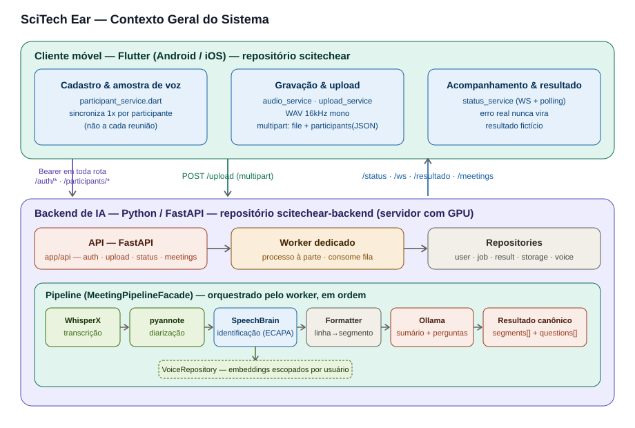

# SciTech Ear — Backend

Backend Python/IA do SciTech Ear: recebe o áudio de uma reunião, transcreve
(WhisperX), separa os falantes (pyannote), identifica quem é cada um por
biometria de voz (SpeechBrain ECAPA) e extrai as perguntas explícitas e
implícitas (LLM via Ollama). Expõe uma API FastAPI consumida pelo app Flutter,
que vive em um repositório separado.

## Fonte de verdade

`SciTech_Ear_Especificacao_Final_Implementacao.docx` (na raiz) é o contrato
de implementação. `AGENTS.md` resume as regras que valem em todo o desenvolvimento.
O plano de execução por fases está em `docs/PLANO_EXECUCAO.md`.

## Estrutura

    app/            # aplicação (a implementar): api, models, services, repositories
    prompts/        # prompts de LLM versionados
    legacy/         # protótipos originais (notebooks + scripts) — NÃO executar em produção
      notebooks/    # transcricao / diarizacao / llm (usam Colab/Drive; só referência)
      scripts/      # etapa2b_diarizacao, etapa3_biometria, cadastro_vozes, pipeline
      banco_vozes/  # banco legado (não versionado; será recriado por participant_id)
    storage/        # artefatos por job (dev/teste; não versionado)
    tests/          # testes
    docs/           # baseline, plano de execução

## Primeiros passos

1. `cp .env.example .env` e preencha o `HF_TOKEN`.
2. Python **3.13** (via `brew install python@3.13`): `python3.13 -m venv .venv &&
   source .venv/bin/activate && pip install -r requirements.txt`. WhisperX,
   pyannote.audio e SpeechBrain exigem Python 3.10+; 3.13 já vinha instalado
   via Homebrew neste Mac e tem wheels prontos para todo o stack (torch,
   torchaudio, ctranslate2, numba) — ver decisão registrada no relatório da
   Fase 2.
3. FFmpeg (necessário para `whisperx.load_audio`, que chama o binário `ffmpeg`
   via subprocess): `brew install ffmpeg`.
4. ~~`ffmpeg@7` + `DYLD_FALLBACK_LIBRARY_PATH` para o `torchcodec` do
   pyannote~~ — **obsoleto**, não é mais necessário. `diarization_service.py`
   carrega o áudio via `soundfile` e passa `{"waveform": tensor,
   "sample_rate": sr}` para o pipeline do pyannote, em vez do caminho do
   arquivo — isso evita completamente o `pyannote.audio.core.io.Audio`
   precisar do `torchcodec` para ler o WAV (mesma abordagem já usada em
   `voice_service.py` desde a Fase 2). Um job real rodado sem
   `DYLD_FALLBACK_LIBRARY_PATH` setado confirmou que a diarização completa
   normalmente. Se `brew install ffmpeg@7` já tiver sido feito antes, pode
   remover (`brew uninstall ffmpeg@7`) — nada mais depende dele.
5. Trabalhe em uma branch de integração (nunca na `main`).
6. Siga a ordem de fases de `docs/PLANO_EXECUCAO.md`. Os serviços em
   `app/services/` são extraídos dos protótipos em `legacy/`.

## Regras que não mudam

Cliente fino no app; a API é a única fronteira; identidade de falante é do
backend (biometria), nunca por posição; `participant_id` é a chave; erro real
nunca vira resultado fictício; nada de Colab/Drive no caminho de execução;
segredos só via ambiente. Detalhes no `AGENTS.md` e na especificação.

## Arquitetura

Documentação completa da arquitetura — pensada para que qualquer pessoa,
mesmo sem contexto prévio do projeto, consiga entender o sistema do zero.
Inclui um glossário de termos, o raciocínio por trás de cada decisão
(não só "o quê", mas "por quê"), e diagramas do fluxo completo.



| Documento | Conteúdo |
|---|---|
| [`docs/ARCHITECTURE.md`](docs/ARCHITECTURE.md) | Visão geral do sistema, glossário, contexto e motivação, máquina de estados do job, contrato de dados |
| [`docs/BACKEND_ARCHITECTURE.md`](docs/BACKEND_ARCHITECTURE.md) | Camadas (API/Services/Repositories/Models), cada serviço explicado, `legacy/`, `prompts/`, como rodar localmente |
| [`docs/PENDENCIAS.md`](docs/PENDENCIAS.md) | Pendências de calibração em acompanhamento |

Se você é novo neste projeto, comece por
[`docs/ARCHITECTURE.md`](docs/ARCHITECTURE.md) — a introdução e o glossário
já dão uma visão de 80% do sistema antes de entrar nos detalhes de cada
camada.

## Rodando com o app em dispositivo físico (Android)

Ao testar o app em um tablet/celular físico via USB (ver README do frontend),
suba o backend assim:

```bash
source .venv/bin/activate
uvicorn app.main:app --reload --host 0.0.0.0 --port 8000
```

`--host 0.0.0.0` é necessário para o servidor aceitar conexões de fora do
`localhost`. O app se conecta via `adb reverse tcp:8000 tcp:8000` (configurado
no lado do frontend), então não é preciso descobrir o IP da máquina nem lidar
com isolamento de rede Wi-Fi entre os aparelhos.
