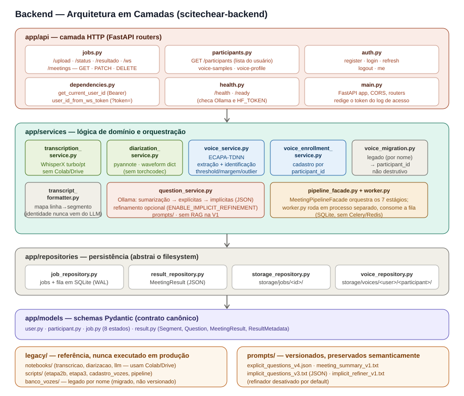

# SciTech Ear — Arquitetura do Backend

> Complementa o [`docs/ARCHITECTURE.md`](./ARCHITECTURE.md) (visão geral do
> sistema, com glossário — leia-o primeiro se ainda não leu). Este documento
> detalha o repositório `scitechear-backend`: cada camada, cada serviço, e
> o raciocínio por trás das decisões que moldaram essa estrutura.

## 1. Visão em camadas



O backend segue uma separação estrita de responsabilidades, organizada em
quatro camadas que só conversam em uma direção — de cima para baixo:

```
app/api          (HTTP: recebe requisições, valida entrada, devolve respostas)
     ↓
app/services      (lógica de domínio: o que o sistema realmente faz)
     ↓
app/repositories  (persistência: onde e como os dados são guardados)
     ↓
app/models        (contrato: a forma dos dados que trafegam entre tudo isso)
```

Essa separação existe por um motivo prático, não só estético: cada camada
pode ser testada e entendida isoladamente. Um teste de um serviço não
precisa subir um servidor HTTP; um teste de uma rota pode simular o
serviço sem rodar nenhum modelo de IA de verdade. `legacy/` e `prompts/`
ficam fora dessa cadeia — são material de apoio, não código executado em
produção (no caso de `legacy/`) ou configuração externa versionada (no
caso de `prompts/`).

## 2. `app/api` — a fronteira HTTP

Esta camada é deliberadamente "burra": ela recebe requisições, valida a
forma dos dados de entrada (usando os schemas Pydantic de `app/models`), e
delega todo o trabalho de verdade para `app/services`. Não há lógica de
negócio aqui — só validação e orquestração de chamadas.

| Arquivo | Rotas | O que faz | Por que é assim |
|---|---|---|---|
| `jobs.py` | `POST /upload`<br>`GET /status/{job_id}`<br>`GET /resultado/{job_id}`<br>`WS /ws/{job_id}` | Recebe o áudio e a lista de participantes; cria um job; expõe o estado atual; expõe o resultado final quando pronto. | O upload devolve `202 Accepted` imediatamente (não espera o processamento), porque uma transcrição real pode levar minutos — bloquear a requisição HTTP até terminar seria uma experiência ruim e arriscaria timeout. |
| `participants.py` | `POST /participants/{id}/voice-samples`<br>`GET /participants/{id}/voice-profile`<br>`DELETE /participants/{id}/voice-profile` | Cadastro, consulta e remoção do perfil de voz de um participante. | Separado de `jobs.py` porque o cadastro de voz tem um ciclo de vida independente das reuniões — uma pessoa se cadastra uma vez, participa de muitas reuniões depois. |
| `health.py` | `GET /health`<br>`GET /ready` | `/health` responde imediatamente, sem carregar nenhum modelo — serve para checagens de infraestrutura ("o processo está vivo?"). `/ready` verifica dependências reais: se o `HF_TOKEN` está configurado, se o Ollama está alcançável. | A distinção entre os dois evita um erro comum: um `/health` que "finge" prontidão quando na verdade uma dependência crítica está fora do ar. `/ready` existe justamente para não mentir sobre isso. |
| `auth.py` | `POST /auth/register`<br>`POST /auth/login`<br>`POST /auth/refresh`<br>`POST /auth/logout`<br>`GET /auth/me` | Registro, login, renovação/rotação de refresh token, logout (revogação) e perfil do usuário autenticado. | Único conjunto de rotas explicitamente público (`/health`/`/ready` também) — todo o resto (`jobs.py`, `participants.py`) exige `Authorization: Bearer <access_token>`. Ver seção 3.9. |
| `main.py` | — | Bootstrap da aplicação FastAPI: registra os routers, configura CORS para desenvolvimento. | Ponto único de montagem da aplicação. |

## 3. `app/services` — onde a inteligência do sistema mora

Esta é a camada mais substancial do backend. Cada serviço tem uma
responsabilidade única e bem delimitada.

### 3.1. `transcription_service.py` — converter áudio em texto

Usa o WhisperX (modelo `turbo`, configurado para português) para
transcrever o áudio, com alinhamento temporal por palavra. É uma
adaptação direta do protótipo original em
`legacy/notebooks/transcricao.ipynb`, com uma diferença crucial: todo
código que dependia de Google Colab ou Google Drive foi removido — o
serviço lê e escreve arquivos locais, de forma portável para qualquer
ambiente Linux com GPU.

O resultado interno inclui informação em nível de palavra (`words`), mas
essa granularidade fica só como artefato interno do pipeline — não faz
parte do contrato canônico exposto ao cliente, que trabalha em nível de
segmento.

### 3.2. `diarization_service.py` — separar as vozes

Usa o pyannote (`pyannote/speaker-diarization-community-1`) para
identificar quantos falantes distintos existem no áudio e quando cada um
fala, produzindo clusters (`SPEAKER_00`, `SPEAKER_01`, …).

Dois detalhes técnicos valem registro porque não são óbvios e já geraram
retrabalho durante o desenvolvimento:

- **O áudio é lido via `soundfile` e passado ao pyannote como um
  dicionário `{"waveform": tensor, "sample_rate": sr}`, não como um
  caminho de arquivo.** A alternativa (passar o caminho como string) faz o
  pyannote tentar decodificar o áudio internamente via `torchcodec`, uma
  dependência frágil que exige uma versão específica de FFmpeg e
  configuração de ambiente que não é portável entre máquinas de
  desenvolvimento e servidores de produção. Carregar o áudio antes,
  seguindo o mesmo padrão já usado em `voice_service.py`, elimina essa
  dependência por completo.
- **Os limites de número de falantes são configuráveis, nunca fixos no
  código.** O protótipo original tinha `MIN_SPEAKERS=4` e `MAX_SPEAKERS=7`
  fixos — o que quebraria silenciosamente para uma reunião de duas
  pessoas. A versão integrada lê `DIARIZATION_MIN_SPEAKERS` e
  `DIARIZATION_MAX_SPEAKERS` do ambiente, e usa
  `expected_speaker_count` (vindo do app, quando informado) apenas como
  uma pista para o algoritmo — nunca como um valor forçado, a menos que
  explicitamente solicitado via `exact_speaker_count`.

**Bug conhecido, baixo risco, não corrigido:** `exact_speaker_count` existe
como parâmetro de `diarizar()`, mas `pipeline_facade.py` nunca o passa como
`True` — só encaminha `expected_speaker_count`, que vira `max_speakers`
(teto), nunca contagem exata. Na prática, hoje não há caminho no pipeline
real que force `num_speakers` exato no pyannote, mesmo quando o app
informa a contagem de falantes. Risco baixo porque o app ainda não coleta
esse campo na UI; passa a importar quando essa coleta existir. Ver
[`docs/PENDENCIAS.md`](./PENDENCIAS.md) para o registro completo.

**Limitação conhecida — áudio distante, ruidoso ou com fala muito
sobreposta pode degradar a qualidade do clustering.** Confirmado por
escuta direta (não hipótese): numa reunião informal de 3 pessoas, gravada
com o dispositivo longe da boca dos falantes, os três clusters produzidos
misturavam vozes de pessoas diferentes. Duas hipóteses mais baratas foram
descartadas antes de concluir isso:

- **Não é `min_speakers`/`max_speakers` mal calibrado.** Reprocessar só a
  diarização com `num_speakers=3` explícito (contagem exata, contornando o
  range default) produziu clusters idênticos aos do range default — o
  pyannote já convergia sozinho para 3 falantes; o erro está em *quem* cada
  cluster representa, não em *quantos* clusters existem.
- **Não é falta de tratamento de fala sobreposta.** O pipeline
  (`pyannote/speaker-diarization-community-1`, `VBxClustering`) já roda com
  `embedding_exclude_overlap=True` por padrão — a mitigação padrão contra
  sobreposição já está ativa.

Avaliação atual: possível limitação estrutural do modelo diante desse
perfil de áudio (campo distante + ruído + fala rápida sobreposta), mais
adverso que os cenários testados anteriormente (voz próxima, pouca
sobreposição). **Recomendação prática, até haver mais dados:** manter o
dispositivo de gravação próximo aos falantes. Calibração fina de
clustering (`threshold`/`Fa`/`Fb` do VBx) e pré-processamento de áudio
(redução de ruído) não foram testados — ficam como possíveis próximos
passos, não decisões tomadas. Ver
[`docs/PENDENCIAS.md`](./PENDENCIAS.md) para o registro completo da
investigação.

### 3.3. `voice_service.py` — extrair e comparar embeddings de voz

Usa o SpeechBrain (modelo ECAPA-TDNN) para duas tarefas relacionadas mas
distintas:

- **Extração**: converter um trecho de áudio em um embedding — um vetor
  numérico que representa o timbre daquela voz.
- **Identificação**: comparar um embedding contra os embeddings
  cadastrados no `VoiceRepository`, decidindo se há uma correspondência
  suficientemente confiável.

O mesmo ponto de entrada de extração é usado tanto no cadastro (seção 3.4)
quanto na identificação durante o processamento de uma reunião — isso é
proposital, para garantir que os embeddings comparados sempre passaram
pelo mesmo pré-processamento, evitando incompatibilidades sutis entre um
embedding gerado no cadastro e outro gerado na hora de identificar.

A decisão sobre se um cluster corresponde a uma pessoa cadastrada depende
de três parâmetros calibráveis:

| Parâmetro | Papel |
|---|---|
| `VOICE_IDENTIFICATION_THRESHOLD` | Score mínimo de similaridade para aceitar uma correspondência. |
| `VOICE_MIN_MARGIN` | Diferença mínima entre o melhor e o segundo melhor candidato — evita aceitar uma identificação ambígua. |
| `VOICE_OUTLIER_THRESHOLD` | Usado para descartar trechos de áudio cujo embedding diverge demais dos demais trechos do mesmo cluster (provável ruído ou erro de diarização). |

Esses três valores são explicitamente tratados como experimentais e
calibráveis — não há garantia de que os valores atuais são os ideais para
todo tipo de áudio; eles existem no `.env` justamente para poderem ser
ajustados sem alterar código, à medida que mais dados reais de uso forem
observados.

**Histórico do `VOICE_IDENTIFICATION_THRESHOLD` — de 0.30 para 0.75, ainda
provisório.** O valor original (0.30) causou um falso positivo grave: um
participante nunca cadastrado foi identificado, com confiança, como outra
pessoa (score 0.9555 contra um perfil real). Recalibrado com embeddings
reais (piso de match genuíno via TTS: 0.9157; teto de impostor: 0.6214)
para **0.75**, deliberadamente mais perto do piso genuíno — a prioridade é
assimétrica: um falso negativo (não identificar alguém) é preferível a um
falso positivo (identificar a pessoa errada). Validação posterior com voz
humana real (não sintética) mostrou scores genuínos na faixa **0.73–0.77**
— parte disso cai abaixo do threshold atual, um falso negativo aceito
conscientemente em troca de manter a barreira contra falsos positivos.
**A calibração continua em andamento**, não é um valor definitivo — ver
[`docs/PENDENCIAS.md`](./PENDENCIAS.md) para o histórico completo,
incluindo um caso residual conhecido (duas vozes sintéticas foneticamente
parecidas) que nenhum threshold de similaridade de cosseno resolve
sozinho.

### 3.4. `voice_enrollment_service.py` — cadastro de voz

Responsável por criar ou atualizar o perfil de voz de um participante. Um
detalhe importante de comportamento: **a cada nova amostra adicionada, o
embedding consolidado do participante é recalculado a partir de todas as
amostras salvas até então — nunca de forma incremental.** Isso é mais
custoso computacionalmente do que simplesmente atualizar uma média, mas é
mais robusto: evita que o embedding "derive" lentamente ao longo de várias
atualizações incrementais mal calculadas.

*Nota operacional:* em 2026-08-13, perfis "Leandro" duplicados (gerados por
testes manuais do endpoint de enrollment antes da integração com um
cliente estável) foram removidos diretamente do `VoiceRepository`. Sem
impacto de arquitetura — o serviço nunca gerou esses IDs, só os
persistiu; ver [`docs/PENDENCIAS.md`](./PENDENCIAS.md) para o detalhe.

### 3.5. `voice_migration.py` — ponte com o banco de vozes legado

Um utilitário isolado, **não destrutivo**, para migrar o banco de vozes
antigo (indexado por nome, em `legacy/banco_vozes/`) para o formato novo
(indexado por `participant_id`, no `VoiceRepository`). Ele nunca apaga os
dados originais — só lê e recadastra.

### 3.6. `transcript_formatter.py` — a ponte entre dados e prompts

Este serviço converte os segmentos diarizados e identificados em linhas de
texto estáveis, formatadas para serem consumidas pelos prompts de LLM
(seção 5), e mantém internamente um mapa de "linha → segmento original".

Esse mapa é o que garante uma propriedade importante do sistema: **quando
uma pergunta é extraída pelo modelo de linguagem, sua identidade (quem
perguntou, em que momento) nunca é inferida a partir do que o próprio
modelo escreveu** — é recuperada de volta, com certeza, a partir do
segmento original, usando o número da linha que o modelo referenciou. Isso
evita um problema sutil e real: modelos de linguagem podem "alucinar" ou
formatar de forma inconsistente o nome de quem falou, então confiar nessa
informação vinda diretamente do texto gerado seria arriscado.

### 3.7. `question_service.py` — sumarização e extração de perguntas

Orquestra três (ou quatro, se o refinamento estiver ativado) chamadas
sequenciais ao Ollama, cada uma usando um prompt versionado em `prompts/`:

1. **Sumarização** — gera um resumo estruturado da reunião. Esse resumo
   não faz parte do contrato final exposto ao cliente; serve como
   contexto adicional para a etapa seguinte.
2. **Perguntas explícitas** — extrai, literalmente, toda sentença
   terminada em `?` na transcrição. O texto da pergunta nunca é reescrito
   ou corrigido pelo sistema — é copiado exatamente como está na
   transcrição original.
3. **Perguntas implícitas** — usando a transcrição e o resumo como
   entrada, o modelo infere perguntas que não foram literalmente
   formuladas, mas que decorrem logicamente do que foi discutido (por
   exemplo, uma decisão pendente mencionada de passagem).
4. **Refinamento (opcional, desativado por padrão)** — uma passada
   adicional que reformula e remove redundâncias das perguntas
   implícitas. Controlado por `ENABLE_IMPLICIT_REFINEMENT`.

**Etapa de implícitas desativada por padrão hoje
(`ENABLE_IMPLICIT_QUESTIONS=false`, `app/config.py`).** Motivo: um
incidente real de confabulação — o modelo gerou 15 perguntas implícitas
formando um roteiro genérico (eficiência energética, valor de revenda
etc.) sobre uma conversa trivial que nunca tocou nesses temas. Corrigido
em duas frentes: o prompt (`implicit_questions_v4.txt`) passou a exigir
`linhas_evidencia` — as linhas reais da transcrição que sustentam cada
pergunta —, e o código (`_resolver_evidencia_implicita`) valida essas
linhas de forma programática, descartando a pergunta inteira se a maioria
das linhas citadas não existir de fato na transcrição (não confia só na
instrução do prompt). Apesar da correção validada, a flag mantém a etapa
desligada por padrão — decisão deliberada de isolar o comportamento do
resto do sistema até haver volume/diversidade suficiente de reuniões reais
validadas. Com a flag desligada: só perguntas `explicit` são retornadas, e
a sumarização (`summarize_meeting`) é pulada junto — hoje ela só existe
como insumo para as implícitas, sem outro consumidor. Os estágios
`summarizing`/`extracting` continuam existindo normalmente na máquina de
estados do job; só o trabalho real dentro deles é pulado. Ver
[`docs/PENDENCIAS.md`](./PENDENCIAS.md) para o histórico completo da
investigação (incluindo validação em reunião substantiva, redundância
residual observada em `qwen3:14b`, e o refinador testado isoladamente).

### 3.8. `pipeline_facade.py`, `job_runner.py` e `app/worker.py` — orquestração e execução

`MeetingPipelineFacade` é o ponto único que conhece a ordem completa das 7
etapas e chama cada serviço na sequência correta, atualizando o estado do
job a cada transição — isso não mudou.

O que mudou foi *quem* dispara essa execução. Até a V1, `/upload` disparava
o pipeline numa thread do próprio processo da API (`InProcessJobExecutor`,
removido). Isso tinha dois problemas, descobertos ao preparar o backend
para produção: reiniciar a API matava qualquer processamento em andamento,
e a cada upload uma thread nova era criada **sem nenhum limite de
concorrência** — várias reuniões enviadas em sequência rápida disputariam a
mesma GPU ao mesmo tempo (o pipeline é GPU-bound: WhisperX, pyannote e
SpeechBrain usam CUDA quando disponível).

Agora:

- **`app/services/job_runner.py`** monta os repositories e a
  `MeetingPipelineFacade` a partir de `get_settings()` — extraído de
  `app/api/jobs.py` para um módulo que não depende da camada HTTP, usado
  tanto pelas rotas (`/upload`, `/resultado`) quanto pelo worker.
- **`app/worker.py`** é um **processo separado** da API (`python -m
  app.worker`), dedicado a consumir a fila de jobs. `/upload` só grava o
  job no banco (`job_repository.create()`) e responde — não dispara nada.
  O worker faz *polling* (`JobRepository.next_queued()`, intervalo
  `WORKER_POLL_INTERVAL_SECONDS`) e processa um job de cada vez,
  sequencialmente — decisão deliberada, não uma limitação: não há
  paralelismo real a ganhar processando dois jobs pesados ao mesmo tempo na
  mesma GPU, então serializar corrige de quebra a contenção de GPU
  descrita acima.
- **A fila é o próprio banco** (`job_repository`, SQLite) — nada de
  Celery/Redis. Ver seção 4 e [`docs/PENDENCIAS.md`](./PENDENCIAS.md) para
  o raciocínio completo por trás dessa escolha (o pipeline GPU-bound com um
  único worker dedicado simplifica o problema o suficiente para não
  justificar um broker externo).
- **Resiliência a crash do worker:** no boot, `app/worker.py` chama
  `JobRepository.requeue_orfaos()` — qualquer job num estágio não-terminal
  só pode ter sido deixado por uma instância anterior do worker que morreu
  no meio do processamento (pressuposto: um único worker por vez).
  Reprocessar do zero é seguro (`pipeline_facade` não faz checkpoint
  parcial), então o padrão é reenfileirar. Proteção contra "job veneno": um
  contador `attempts` (coluna em `jobs`) limita quantas vezes um mesmo job
  pode ser reenfileirado (`WORKER_MAX_ATTEMPTS_BEFORE_ERROR`, default 3) —
  excedido isso, o job vai para `error` (`WORKER_MAX_TENTATIVAS_EXCEDIDO`)
  em vez de travar a fila para sempre num loop de crash.

### 3.9. `auth_service.py` e `app/api/auth.py` — autenticação real

Substitui a `AuthScreen` mock do app (sem chamada real ao backend) por
autenticação de verdade: JWT (access + refresh), senha com hashing Argon2id
(`argon2-cffi` — não `passlib`, que está sem release desde 2020 e tem um bug
conhecido, não corrigido, com `bcrypt>=4.1`), e rate limiting simples contra
força bruta. Consumo pelo app (tela real, armazenamento seguro de token,
anexar token nas chamadas existentes) é trabalho do repositório do
Flutter, tratado numa sessão separada — este item cobre só o contrato do
lado do backend.

**Decisão de escopo (a única aberta de propósito na proposta original, não
decidida sozinha): reuniões e perfis de voz passam a ser isolados por
conta.** Antes desta mudança, `participant_id` e o estado dos jobs eram
globais — qualquer cliente da API via/cadastrava os mesmos dados, sem noção
de dono. Escolhida a isolação completa (não só "JWT como porteiro, dados
continuam globais") por dois motivos concretos: a tela do app já se chama
"Suas Reuniões" (a alternativa deixaria a UI mentindo), e perfil de voz é
dado biométrico — sem isolamento, qualquer conta autenticada poderia
consultar/apagar o perfil de qualquer `participant_id` cadastrado por
outra conta. Efeito no restante do sistema: seção 4 (`job_repository.py`,
`VoiceRepository`).

**Tokens:**
- **Access token**: JWT (`PyJWT`, HS256), expira em
  `JWT_ACCESS_TOKEN_EXPIRE_MINUTES` (default 30 min) — stateless, validado
  só pela assinatura, sem consulta ao banco a cada request.
- **Refresh token**: JWT também, expira em `JWT_REFRESH_TOKEN_EXPIRE_DAYS`
  (default 30 dias), mas **rastreado em banco** (tabela `refresh_tokens`,
  ver seção 4) — diferente do access token, precisa ser revogável, senão
  `POST /auth/logout` seria decorativo (o token continuaria válido até
  expirar sozinho). Cada `POST /auth/refresh` bem-sucedido **rotaciona**: o
  token usado é revogado e um par novo é emitido — mitigação padrão contra
  reuso de um refresh token vazado.

**Rate limiting** (tabela `auth_failed_attempts`, mesmo SQLite, sem
infraestrutura nova — limpeza de linhas fora da janela é oportunista, a
cada escrita, em vez de um job de limpeza separado):
- `/auth/login`: chave por **e-mail** (protege uma conta específica contra
  adivinhação de senha; IP teria falsos positivos atrás de CGNAT/redes
  móveis compartilhadas) — `AUTH_LOGIN_MAX_ATTEMPTS` falhas em
  `AUTH_LOGIN_WINDOW_MINUTES` bloqueia por `AUTH_LOGIN_LOCKOUT_MINUTES`
  (`429` com header `Retry-After`, mensagem genérica). Login bem-sucedido
  zera o contador.
- `/auth/register`: chave por **IP** (não há conta "alvo" a proteger aqui —
  o risco é criação em massa) — `AUTH_REGISTER_MAX_ATTEMPTS` em
  `AUTH_REGISTER_WINDOW_MINUTES`. `request.client.host` sem proxy reverso
  confiável configurado ainda (dev/V1); revisar para `X-Forwarded-For`
  quando a topologia de deploy for definida.

**Todo endpoint de `jobs.py` e `participants.py` exige
`Authorization: Bearer <access_token>`** — `/health`/`/ready` continuam
públicos (probes de infraestrutura). `WS /ws/{job_id}` recebe o token por
query param (`?token=`), não header — handshake de WebSocket não permite
header customizado em todo cliente.

**Ownership**: `GET /status/{job_id}` e `GET /resultado/{job_id}` devolvem
`404` (não `403`) tanto para job inexistente quanto para job de outro
usuário — de propósito, para não revelar a outros usuários que um
`job_id` alheio existe. Nova rota `GET /meetings` (não existia antes —
sem ela "Suas Reuniões" não tinha como ser alimentada pelo backend) lista
as reuniões do usuário autenticado.

## 4. `app/repositories` — onde os dados moram

Cada repositório abstrai uma forma de persistência, para que o resto do
sistema não precise saber os detalhes de como e onde os dados ficam
guardados fisicamente:

- **`user_repository.py`** — contas (`users`), refresh tokens rastreados
  (`refresh_tokens`) e tentativas de autenticação falhas para rate limiting
  (`auth_failed_attempts`). Mesmo SQLite de `job_repository.py` (mesma
  `DATABASE_URL`), Base própria SQLAlchemy, self-contained, mesmo padrão de
  schema criado automaticamente no primeiro uso. Ver seção 3.9.
- **`job_repository.py`** — mantém o estado de todos os jobs em **SQLite**
  (via SQLAlchemy), não mais em memória: reiniciar o servidor já não apaga
  jobs em andamento. Três tabelas: `jobs` (estado atual de cada job,
  incluindo `attempts` — contador de tentativas usado pela proteção contra
  "job veneno", ver seção 3.8), `job_status_events` (uma linha por
  transição de status, insert-only, alimenta `stage_durations()`). A
  interface pública (`create`/`get`/`update_status`/`stage_durations`,
  mais `next_queued`/`requeue_orfaos` da fila) não exigiu mudanças em quem
  já a consumia (`pipeline_facade.py`, `app/api/jobs.py`). Desde a
  autenticação real (item 3), todo job tem um `user_id` (dono); `get()`
  continua ownership-agnostic (usado pelo worker, que processa qualquer job
  da fila sem se importar com dono) — `get_owned()`/`list_by_user()` são as
  versões escopadas usadas pelas rotas HTTP (`GET /status`, `/resultado`,
  `/meetings`). Configurável via
  `DATABASE_URL` (`.env`); vazio usa `sqlite:///<STORAGE_ROOT>/jobs.db` por
  padrão — zero infraestrutura extra, schema criado automaticamente no
  primeiro uso. SQLite (com modo WAL) foi escolhido em vez de Postgres
  justamente para manter esse princípio de zero-infra — inclusive como
  fila real (seção 3.8), não só como armazenamento de estado; a troca para
  outro banco fica barata depois (só mudar a URL, mesmo código SQLAlchemy)
  se o volume um dia justificar. `status_history`/`stage_durations()`
  (tabela `job_status_events`) segue existindo só para instrumentação de
  performance, não faz parte do contrato HTTP (a resposta de `GET
  /status/{job_id}` continua expondo só o status atual). Ver
  [`docs/PERFORMANCE.md`](./PERFORMANCE.md) para as medições dessa
  instrumentação.

  Tanto o registro quanto a *execução* de um job agora sobrevivem a
  restart (do processo da API e do worker, respectivamente) — a limitação
  residual que existia aqui logo após a migração para SQLite (job
  congelado para sempre se o restart pegasse no meio do processamento) foi
  resolvida pelo item seguinte da preparação para produção (worker
  dedicado + fila real, seção 3.8). Ver
  [`docs/PENDENCIAS.md`](./PENDENCIAS.md) para o histórico completo.
- **`result_repository.py`** — persiste o resultado final de cada job como
  um arquivo JSON, permitindo que `GET /resultado/{job_id}` seja servido
  sem reprocessar nada.
- **`storage_repository.py`** — organiza os artefatos de cada job (o áudio
  recebido, e outros arquivos intermediários) em `storage/jobs/<job_id>/`.
- **`voice_repository.py`** — organiza os perfis de voz em
  `storage/voices/<user_id>/<participant_id>/` (aninhado por conta desde a
  autenticação real, item 3 — ver seção 3.9), guardando o embedding
  consolidado e metadados (quantas amostras, quando foi atualizado pela
  última vez, qual versão do modelo gerou o embedding — importante para
  saber quais perfis precisam ser recalculados se o modelo de voz for
  trocado no futuro). `participant_id` deixou de ser único globalmente —
  só dentro do namespace de cada usuário.

Nenhum desses repositórios depende de um provedor de nuvem — tudo é
armazenamento local (arquivo SQLite ou arquivos JSON/tensor em disco), o
que mantém o backend portável e simples de rodar em qualquer servidor
Linux com GPU.

## 5. `app/models` — o contrato formal

Define, via schemas Pydantic, exatamente a forma dos dados que trafegam
entre as camadas e, principalmente, entre o backend e o cliente:
`participant.py`, `job.py` (com os 8 estados possíveis), e `result.py`
(`TranscriptSegment`, `Question`, `MeetingResult`, `ResultMetadata`). O
contrato completo, com exemplos, está documentado em
[`docs/ARCHITECTURE.md`](./ARCHITECTURE.md#9-contrato-de-dados-canônico).

## 6. `legacy/` — de onde este sistema veio

Antes de existir como um backend integrado, cada etapa do pipeline foi
prototipada e validada de forma independente, em notebooks e scripts
Python soltos. Esse material está preservado em `legacy/`, **nunca
executado como parte do sistema em produção** — serve como referência
histórica e como prova de que os algoritmos centrais (diarização,
biometria) foram validados antes da integração.

- **`notebooks/`** — `transcricao.ipynb`, `diarizacao.ipynb`, `llm.ipynb`.
  Escritos originalmente para rodar no Google Colab, com dependência de
  Google Drive para entrada e saída de arquivos — por isso não podem
  (nem devem) ser executados como parte do backend real.
- **`scripts/`** — `etapa2b_diarizacao.py`, `etapa3_biometria.py`,
  `cadastro_vozes.py`, `pipeline.py`: versões em script dos mesmos
  algoritmos, mais próximas da forma final, mas ainda usando o banco de
  vozes indexado por nome (em vez de `participant_id`) e caminhos de
  arquivo fixos.
- **`banco_vozes/`** — a estrutura do banco de vozes legado. Não contém
  dados reais neste repositório (áudios e embeddings não são versionados,
  por serem dados biométricos e por peso); existe só a estrutura de
  referência e a documentação de como o `voice_migration.py` pode
  trazer dados legados reais para o formato novo, se algum dia existirem.

## 7. `prompts/` — as instruções dadas ao modelo de linguagem

Prompts são tratados como um artefato de engenharia versionado, não como
texto solto embutido no código. Mudanças neles são revisadas com o mesmo
cuidado que mudanças em código — alterar um prompt pode mudar
silenciosamente o comportamento do sistema.

| Arquivo | Função | Nota |
|---|---|---|
| `explicit_questions_v4.json` | Extrai literalmente toda sentença terminada em `?`. | O prompt é deliberadamente rígido: não pede interpretação, só varredura textual. |
| `meeting_summary_v1.txt` | Gera o resumo estruturado usado como contexto interno. | Não é exposto ao cliente diretamente. |
| `implicit_questions_v4.txt` | Extrai perguntas implícitas, em formato JSON, exigindo `linhas_evidencia` (linhas reais da transcrição) por pergunta. | Evolução do `v3` (preservado como referência histórica; `v2` também preservado), corrigindo um incidente real de confabulação — o teto de "até 15 perguntas" era tratado como meta, não limite, e o modelo inventava temas nunca discutidos. `v4` reformula o teto como limite absoluto, declara lista vazia como saída válida para conteúdo trivial, e adiciona a exigência de evidência rastreável, validada em código (`question_service._resolver_evidencia_implicita`). Etapa desligada por padrão hoje (`ENABLE_IMPLICIT_QUESTIONS=false`) — ver §3.7 e `docs/PENDENCIAS.md`. |
| `implicit_refiner_v1.txt` | Refina e consolida as perguntas implícitas. | Desativado por padrão (`ENABLE_IMPLICIT_REFINEMENT=false`); existe para uso futuro. |

## 8. Pendências de calibração conhecidas

Nem todo comportamento observado durante o desenvolvimento é um bug de
código — alguns são resultado de limitações do modelo de linguagem usado,
e ficam registrados separadamente para acompanhamento, em vez de
misturados com decisões de arquitetura já fechadas. Ver
[`docs/PENDENCIAS.md`](./PENDENCIAS.md) para o registro vivo desses
achados — por exemplo, modelos menores do Ollama nem sempre respeitam à
risca o formato de saída pedido no prompt de perguntas explícitas,
comportamento que precisa ser reverificado com o modelo de produção antes
de ser considerado resolvido ou não. Ver também
[`docs/PERFORMANCE.md`](./PERFORMANCE.md) para medições de tempo por
estágio do pipeline e o raciocínio por trás de otimizações já testadas
(aplicadas ou revertidas).

## 9. Configuração e como rodar localmente

Todas as variáveis de ambiente relevantes estão documentadas em
`.env.example`, na raiz do repositório. As mais importantes do ponto de
vista arquitetural:

```env
HF_TOKEN=                          # obrigatório — o modelo do pyannote é "gated" no Hugging Face
STORAGE_ROOT=./storage
DATABASE_URL=                      # vazio usa sqlite:///<STORAGE_ROOT>/jobs.db (ver §4)
WORKER_POLL_INTERVAL_SECONDS=2.0    # ver §3.8 (app/worker.py)
WORKER_MAX_ATTEMPTS_BEFORE_ERROR=3  # proteção contra "job veneno", ver §3.8
WHISPERX_MODEL=turbo
WHISPERX_LANGUAGE=pt
DIARIZATION_MODEL=pyannote/speaker-diarization-community-1
DIARIZATION_MIN_SPEAKERS=1
DIARIZATION_MAX_SPEAKERS=10
VOICE_MODEL=speechbrain/spkrec-ecapa-voxceleb
VOICE_IDENTIFICATION_THRESHOLD=0.75   # recalibrado de 0.30; ver §3.3 — ainda provisório
VOICE_MIN_MARGIN=0.05
VOICE_OUTLIER_THRESHOLD=0.45
OLLAMA_BASE_URL=http://127.0.0.1:11434
OLLAMA_MODEL=qwen3:14b
ENABLE_IMPLICIT_QUESTIONS=false       # etapa de perguntas implícitas desligada por padrão; ver §3.7
ENABLE_IMPLICIT_REFINEMENT=false
DEMO_MODE=false
JWT_SECRET_KEY=                       # obrigatório em produção — `openssl rand -hex 32`; ver §3.9
JWT_ACCESS_TOKEN_EXPIRE_MINUTES=30
JWT_REFRESH_TOKEN_EXPIRE_DAYS=30
AUTH_LOGIN_MAX_ATTEMPTS=5             # rate limiting de /auth/login e /auth/register; ver §3.9
AUTH_REGISTER_MAX_ATTEMPTS=10
```

Para desenvolvimento local:

```bash
python -m venv .venv
source .venv/bin/activate
pip install -r requirements.txt
cp .env.example .env   # preencher HF_TOKEN
uvicorn app.main:app --reload
```

O servidor sobe em `http://0.0.0.0:8000` por padrão, o que é necessário
para ser alcançável por um emulador Android ou dispositivo físico na mesma
rede (não apenas por `localhost`).

**Processamento de jobs precisa do worker rodando** (§3.8) — sem ele,
`/upload` cria o job normalmente, mas ele fica parado em `queued` para
sempre, já que ninguém consome a fila. Num segundo terminal:

```bash
source .venv/bin/activate
python -m app.worker
```

Nenhum serviço externo é necessário (nada de Redis) — API e worker são só
dois processos Python apontando pro mesmo `STORAGE_ROOT`/`DATABASE_URL`. Em
produção, cada um vira sua própria unidade systemd (ou equivalente), com
restart automático independente um do outro.

## 10. Abordagem de testes

Os testes automatizados privilegiam **testes de contrato com fixtures**
sobre execução real de modelos pesados — rodar WhisperX, pyannote ou
SpeechBrain de verdade em cada execução da suíte de testes seria lento e
exigiria GPU. Em vez disso, os testes mockam essas etapas e verificam: a
forma dos dados trocados entre camadas, as transições de estado do job, o
comportamento correto diante de erros em cada etapa, e a fidelidade dos
schemas Pydantic ao contrato canônico. Validações com modelos reais são
feitas manualmente durante o desenvolvimento de cada funcionalidade, e
seus resultados ficam registrados nas notas de cada etapa de
implementação, mas não fazem parte da suíte automatizada de CI.

## 11. Escopo da V1 e próximos passos conhecidos

A V1 assume: **um único worker dedicado** (sem paralelismo entre jobs —
decisão deliberada, não lacuna, já que o pipeline é GPU-bound e uma única
GPU por servidor não ganha nada processando dois jobs pesados ao mesmo
tempo), e WebSocket de status como um recurso complementar ao polling (não
uma dependência crítica).
Esses pontos são decisões conscientes de escopo, não lacunas esquecidas —
a interface de cada componente já foi desenhada considerando essas
evoluções futuras, para que não exijam reescrever contratos já
estabelecidos.

**Preparação para produção — progresso:**

1. ✅ **Persistência real do estado do job** (`job_repository.py` em
   SQLite, ver seção 4) — reiniciar o servidor não apaga mais jobs em
   andamento.
2. ✅ **Fila real com execução resiliente** (`app/worker.py`, processo
   dedicado, fila no próprio SQLite — sem Celery/Redis, ver seção 3.8) —
   resolve por completo a limitação residual que o item 1 deixou em
   aberto (job congelado para sempre se o restart pegasse no meio do
   processamento): agora o worker sobrevive independentemente da API, e
   reenfileira automaticamente jobs órfãos no boot, com proteção contra
   "job veneno" (`attempts`/`WORKER_MAX_ATTEMPTS_BEFORE_ERROR`). Efeito
   colateral corrigido de quebra: o `InProcessJobExecutor` antigo não
   limitava concorrência nenhuma (cada upload virava uma thread nova,
   sem fila) — hoje o processamento é serializado de verdade.

   **Teto conhecido desta escolha:** a fila no banco escala para mais de
   um worker na mesma máquina (a mesma GPU, então sem ganho real hoje),
   mas **não** entre máquinas diferentes — SQLite não é seguro em
   filesystem compartilhado entre servidores. Se um dia houver mais de um
   servidor com GPU, essa camada precisaria migrar para Postgres (com
   claim atômico) ou para um broker real (Celery/Redis). Não há evidência
   hoje de que isso seja necessário — o projeto é documentado como "um
   servidor Linux com GPU", singular.
3. ✅ **Autenticação real** (`auth_service.py`/`app/api/auth.py`, JWT +
   Argon2id + rate limiting, ver seção 3.9) — substitui a `AuthScreen` mock
   do app (o consumo em si — tela real, storage seguro de token — é
   trabalho do outro repositório, sessão separada). Decisão de escopo
   tomada (não sozinho): reuniões e perfis de voz passam a ser isolados
   por conta (`jobs.user_id`, `VoiceRepository` aninhado por `user_id`) —
   ver seção 3.9 para o raciocínio completo. Efeito colateral: nova rota
   `GET /meetings` (não existia antes), necessária para a tela "Suas
   Reuniões" ter o que listar.

   **Migração de dados pré-autenticação:** os 11 perfis de voz cadastrados
   antes deste item (`storage/voices/<participant_id>/`, sem dono) foram
   primeiro deduplicados — 3 perfis "Leandro" existiam (cadastros de teste
   em datas diferentes, nenhum com mais amostras que os outros); mantido
   só o mais recente (`1788038289268569`, 2026-08-29), os outros dois
   removidos. Os 9 perfis restantes foram então atribuídos à conta
   `leandro.freitas@ifg.edu.br` via `scripts/migrate_voices_to_user.py`
   (script one-off, idempotente — identifica perfil legado pela presença
   de `profile.json` direto sob `storage/voices/<algo>/`, nunca cria conta
   nem mexe em senha). Nenhum job existia no banco local no momento desta
   migração (`jobs`/`job_status_events` vazias) — as tabelas foram
   recriadas do zero com o schema novo (`user_id` em `jobs`), sem
   necessidade de migração de dado real.
