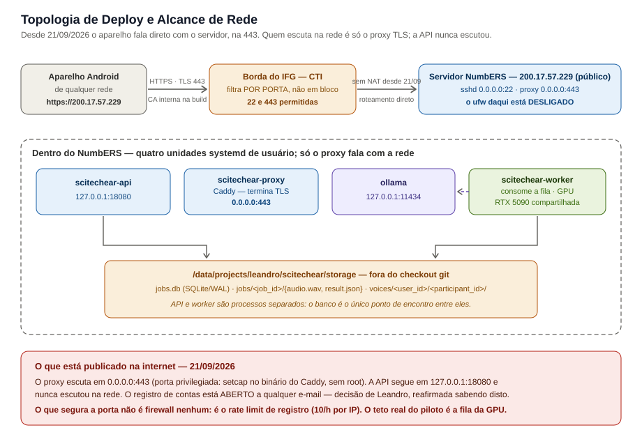

# Deploy — SciTech Ear · Backend

Como o backend está implantado hoje, e por quê. Até aqui isso não estava em
lugar nenhum do repositório: quem pegasse o projeto do zero não teria como
saber onde ele roda, em que porta, ou o que quebra ao mexer.

O ambiente de referência é o servidor **NumbERS** do IFG. Nada aqui é
específico dele a ponto de não servir para outro servidor Linux com GPU — mas
as decisões abaixo foram tomadas para uma **máquina compartilhada**, e é isso
que explica quase todas elas.

## O ambiente

| | |
|---|---|
| Máquina | `numbersia` — Ubuntu 24.04, 2× RTX 5090 (32 GB cada) instaladas, mas **só uma em operação** desde 19/09/2026 — ver "GPU0 fora de operação" abaixo |
| Endereço | **`200.17.57.229/28` público e roteável** desde 2026-09-21 (gateway `200.17.57.225`), estático no netplan. Antes: `10.4.254.201/16` privado atrás de NAT |
| Compartilhada com | outros pesquisadores (há um ComfyUI de terceiro na mesma GPU) |
| Fila de GPU | **não existe** — sem Slurm, sem árbitro; a convivência é por disciplina |
| GPU em uso | **uma só**: a da PCI `0000:c1:00`, dividida com o Ollama e com os outros projetos. Sem redundância |
| Python | 3.12 do sistema (daí o `.python-version` fixado) |
| Torch | 2.8.0+cu128 — o índice cu130 não tem torch 2.8, e o WhisperX pina `torch~=2.8.0`; o driver 590/CUDA 13.1 roda binários cu128 sem ajuste (sm_120 confirmado) |

### GPU0 fora de operação desde 19/09/2026 — limitação operacional aberta

A máquina tem duas RTX 5090 instaladas, e **uma delas parou**. Não é
configuração, não é driver e não é algo que se conserte daqui.

| | |
|---|---|
| Placa afetada | GPU0, PCI `0000:21:00` |
| Quando | 19/09/2026 |
| Sintoma no kernel | **Xid 79** — *GPU has fallen off the bus* |
| Causa | **física**, confirmada; não tem relação com o software deste projeto |
| Estado | aguardando **reparo físico pelo administrador do servidor** |
| Enquanto isso | tudo roda na GPU1 (PCI `0000:c1:00`), **sem redundância** |

O Xid 79 e a data vêm do diagnóstico do administrador — o `kern.log` daquele
dia é legível só pelo grupo `adm`. O que se confere sem privilégio nenhum, e
que basta para saber em que estado a máquina está agora:

    nvidia-smi
    # → Unable to determine the device handle for GPU0: 0000:21:00.0: Unknown Error
    # e a tabela lista só a GPU de índice 1, em 00000000:C1:00.0

    lspci | grep -i nvidia
    # → 21:00.0 e c1:00.0 ainda aparecem: o hardware está no barramento PCI,
    #   quem não consegue inicializá-lo é o driver

    .venv/bin/python -c "import torch; print(torch.cuda.device_count())"
    # → 1   (e um UserWarning: Can't initialize NVML)

**O que isso custa ao piloto.** Não é desempenho — é margem. O pipeline é
GPU-bound e o worker é serial por decisão (um job por vez), então uma GPU
parada não torna um job mais lento; ela remove o lugar para onde correr. Hoje
o worker, o Ollama (`qwen3:14b`, 14 GB de VRAM) e os outros projetos da
máquina dividem **a mesma placa**, e uma falha nela para o sistema inteiro em
vez de degradá-lo. Antes de rodar algo pesado, `nvidia-smi` — e agora ele
mostra uma placa só.

### O que mudou em 2026-09-21: a máquina ganhou IP público

O admin trocou o endereçamento da `eno1`. Três consequências, e a terceira é a
que mais dá trabalho:

1. **O NAT acabou.** Antes a máquina era `10.4.254.201/16` privada, e o
   `200.17.57.4` que se via de fora era NAT de *saída* compartilhado — mão
   única, ninguém de fora iniciava conexão. Agora `curl ifconfig.me` devolve
   `200.17.57.229`, o mesmo endereço da interface: o roteamento é direto, nos
   dois sentidos.
2. **O pedido de DNAT ao CTI deixou de existir.** Era a Etapa 2 inteira do
   `PLANO_EXPOSICAO_REDE.md`, e foi atendida — de forma melhor do que o pedido.
   O que resta do CTI é opcional: um nome DNS.
3. **`10.4.254.201` morreu, e levou junto tudo que o citava.** SAN do
   certificado, `default_sni`, endereço do site no `Caddyfile`, os
   `--dart-define` do app e os exemplos de `curl` desta documentação. Não é um
   endereço que "mudou de valor": é um endereço que a máquina não tem mais, e
   qualquer coisa apontada para lá falha com *connection timeout*, não com erro
   de TLS — sintoma que não sugere a causa.

**Ter IP público não expôs nada por si só.** O endereço resolveu o problema de
*roteamento*; a *escuta* e o *filtro* continuaram de pé por mais algumas horas
— e é a seção seguinte que os derruba.

### Ainda em 2026-09-21: quem filtrava era a borda, e a 443 foi liberada

Duas correções de fato, nesta ordem, porque a segunda só faz sentido depois da
primeira.

**O `ufw` desta máquina está DESLIGADO.** Esta documentação afirmou o contrário
por duas semanas, e o erro tem uma causa específica que vale registrar para
ninguém repetir: `/etc/default/ufw` traz `DEFAULT_INPUT_POLICY="DROP"`, e esse
arquivo diz a política que o ufw *usaria se estivesse ligado* — não que ele
esteja. Quem responde é `ufw status` (`inactive`), e o estado real está em
`/etc/ufw/ufw.conf` (`ENABLED=no`). Armadilha extra: `systemctl is-active ufw`
responde `active` mesmo assim, porque a unidade *oneshot* rodou.

Prova sem root, do próprio servidor, que vale reusar:

    bash -c 'cat </dev/null >/dev/tcp/200.17.57.229/443'

Numa porta sem ouvinte isso deu **`Connection refused` imediato**. Regra `DROP`
daria travamento até o timeout; RST instantâneo prova que **não há filtro
local**. Na `22` conecta normalmente.

**Quem descarta é a borda do IFG — e isso é do CTI, não do admin da máquina.**
Medido em 2026-09-21: um ouvinte em `0.0.0.0:18444` aqui, mais um `curl` de
fora (MacBook, rede da Linq Telecom), deu `Connection timed out`. Mas a borda
filtra **por porta**, não bloqueia tudo — há sessões SSH estabelecidas vindas
da internet para a `:22`. Daí a conclusão que redesenhou o plano: achar uma
porta já permitida dispensaria o pedido ao CTI.

**A porta liberada foi a 443**, e o proxy se mudou para ela. Não foi
preferência: a 18443 nunca passaria pela borda, e a 443 já passava. O custo é
que 443 é **porta privilegiada** — ver [a seção do proxy](#o-proxy-tls-na-443)
para como ela é aberta sem o serviço virar root.

O que isso publica, dito aqui e não em nota de rodapé: o backend está **na
internet**, não na rede do IFG.

Por algumas horas de 2026-09-21 isso foi um **cadastro aberto na internet** —
`AUTH_ALLOWED_EMAIL_DOMAINS` estava deliberadamente vazia, e o único
amortecedor era o rate limit de registro (10/h por IP), dimensionado para
quando um IP ainda identificava alguém. **Não é mais o caso:** ainda em
2026-09-21, junto com a revisão do modelo de acesso, a allowlist institucional
foi **religada** (ver a seção de allowlist adiante). Quem chega ao registro
sem e-mail institucional recebe `403`. O rate limit continua onde estava, agora
como segunda camada e não como única.

## Layout no disco

    /data/projects/leandro/
      leandroalexandre-ifg-scitechear-backend/   # o checkout git + .venv/
      scitechear/
        storage/     # STORAGE_ROOT: áudios, resultados, jobs.db, perfis de voz
        hf-cache/    # HF_HOME (~4 GB)
        ollama/      # OLLAMA_MODELS (~9 GB) — blobs dos modelos

**Os dados ficam deliberadamente FORA do checkout.** Um `git clean`, um
`git checkout` agressivo ou um re-clone não podem alcançar dado de usuário —
áudio de reunião, perfil de voz e banco não são recuperáveis a partir do
repositório. `STORAGE_ROOT` no `.env` aponta para lá com caminho absoluto.

A convenção `/data/projects/<usuario>/` é do servidor, criada pelo admin.

## Os quatro serviços

Tudo roda como **unidade systemd de usuário** (`~/.config/systemd/user/`), não
de sistema. Em máquina compartilhada isso é o que evita ter que coordenar com
quem administra o servidor a cada mudança de configuração.

| Unidade | O que é | Porta |
|---|---|---|
| `scitechear-api` | FastAPI/uvicorn | `127.0.0.1:18080` (ver abaixo) |
| `scitechear-worker` | consumidor da fila de jobs (usa a GPU) | — |
| `ollama` | servidor do LLM (`qwen3:14b`) | `127.0.0.1:11434` |
| `scitechear-proxy` | proxy TLS (Caddy) na frente da API — ver [`TLS.md`](TLS.md) | **`0.0.0.0:443`** — o único na rede (ver abaixo) |

    systemctl --user status scitechear-api scitechear-worker ollama scitechear-proxy
    systemctl --user restart scitechear-api
    journalctl --user -u scitechear-worker -f

**Depende de `linger`**: sem `loginctl enable-linger leandro`, as unidades de
usuário morrem quando a sessão SSH termina. Já está habilitado — mas é a
primeira coisa a checar se os serviços "somem" depois de um logout.

**A API está em loopback, e três dos quatro serviços também.** A porta `18080`
(e não `8000`) é para não colidir com o default que qualquer outro projeto
Python da máquina escolheria. Quem fala com a rede é **só o proxy**, e essa
divisão é a regra que não se negocia aqui: a API nunca escuta fora do
loopback, porque ela fala HTTP puro — senha e áudio de reunião em claro.

### O proxy TLS na 443

O proxy subiu como serviço em 2026-09-06 escutando em `127.0.0.1:18443`, e
ficou nesse loopback por duas semanas: servia para testar HTTPS por túnel SSH
sem depender de ninguém. Em 2026-09-21 ele passou a `0.0.0.0:443`.

A troca de porta **não exigiu reemitir o certificado** — porta não entra em
certificado. O SAN continua sendo `IP:200.17.57.229`, e a raiz da CA interna
(válida até 2036) não mudou, então **nenhuma build nova do app**: só o endereço
do `--dart-define` muda, e muda para melhor, perdendo o `:18443`.

    https://200.17.57.229:18443   →   https://200.17.57.229

**443 é porta privilegiada, e este serviço não roda como root.** As duas
linhas que pagam essa conta, ambas inseparáveis:

    sudo setcap cap_net_bind_service=+ep ~/.local/bin/caddy
    # + remover NoNewPrivileges=yes de scitechear-proxy.service

Sozinho, o `setcap` **não tem efeito nenhum**: com `NoNewPrivileges=yes` o
kernel ignora capability de arquivo, e o bind falha com `permission denied` sem
apontar para a unidade. Foi a opção de menor alcance entre as duas possíveis —
a outra, `sysctl net.ipv4.ip_unprivileged_port_start=443`, liberaria a faixa
`443–1023` para **todos os usuários** de uma máquina compartilhada.

> **Depois de atualizar o Caddy, confira `getcap ~/.local/bin/caddy`.** A
> capability mora no inode do binário: trocar o arquivo a apaga, e o serviço
> entra em loop de restart no próximo boot — sem ninguém olhando.

Houve um bind da **API** em `0.0.0.0` em 2026-09-05, **revertido no mesmo dia**
por decisão de Leandro, e a reversão envelheceu bem: escutar na `eno1` com a
API significaria senha e áudio de reunião em **HTTP puro** ao alcance de quem
chegasse à porta. Na época isso queria dizer a `10.4.0.0/16`, a instituição
inteira; hoje, com IP público e a 443 aberta, queria dizer a internet.

**Esse bind não é mais uma pendência — é um erro.** A pergunta que ele tentava
responder (como alcançar a API de fora) foi respondida pelo proxy TLS: quem
escuta na rede é o Caddy, na 443, e ele repassa em loopback. Pôr a API na rede
hoje não destravaria nada e só tiraria o TLS do caminho. Se `ss -ltn` algum dia
mostrar `0.0.0.0:18080`, é para parar tudo e desfazer.

Onde houver bind na rede — hoje, só o do proxy — use `0.0.0.0` e **não** o IP
específico. A justificativa original era o DHCP; ela mudou de forma em
2026-09-21 sem mudar de conclusão.
O endereço hoje é **estático** (`200.17.57.229`, posto no netplan pelo admin —
não há lease em `/run/systemd/netif/leases/`), então o bind num IP literal
passou a ser tecnicamente possível. Continua sendo errado: amarra o serviço a
uma decisão do admin que pode mudar sem aviso, e a falha resultante é *cannot
assign requested address* em loop de restart — no boot, sem ninguém olhando. As
demais interfaces (`docker0`, bridges, `wlp101s0`, `enp103s0`) estão DOWN,
então na prática isso seria `eno1` + loopback. **Quem pode chegar à porta é
responsabilidade do firewall**, que é a camada certa para isso; restringir pelo
bind seria frágil e daria uma falsa sensação de controle.

Com a medição de 2026-09-21, sabe-se onde essa camada mora: **não é nesta
máquina** (o `ufw` está desligado), é na **borda do IFG**, que filtra por porta
e é operada pelo CTI. Na prática, portanto, quem chega à porta não é decidido
por nós — é decidido pela allowlist de e-mail (desligada) e pelo rate limit.

Há cópias datadas da unidade em
`/data/projects/leandro/scitechear/scitechear-api.service.bak-*`.

O Ollama foi instalado **sem privilégio de root**, em `~/.local/bin`, mesmo com
o usuário estando no grupo `sudo`: o único ganho do root seria compartilhar o
servidor e os 9 GB do modelo com outros pesquisadores, e ninguém mais pediu
LLM.

## Como o app alcança o backend

**Desde 2026-09-21: direto, pela internet, em `https://200.17.57.229`** (porta
443, sem número de porta na URL, sem túnel e **sem VPN**). Quem termina TLS e
escuta na rede é o proxy Caddy; a API continua em `127.0.0.1:18080` e nunca
escutou na rede — o IP público não mudou isso, e não deve mudar.

O único requisito do lado do app é a **raiz da CA interna na build**
(`deploy/scitechear-root-ca.crt`), porque a CA não é pública. O procedimento
está em [`TLS.md`](TLS.md); os `--dart-define` são
`SCITECH_API_BASE_URL=https://200.17.57.229` e
`SCITECH_WS_BASE_URL=wss://200.17.57.229`.

### Alternativa: túnel SSH (desenvolvimento)

Deixou de ser o caminho do piloto, mas continua útil para depurar contra a API
crua, **sem passar pelo proxy** — foi assim que se isolou o falso defeito do
`4401`. Nenhum privilégio novo, nada a pedir ao admin. Na máquina de
desenvolvimento (com IP público, a VPN deixou de ser necessária para chegar ao
`sshd`):

    ssh -N -L 18080:127.0.0.1:18080 leandro@numbersia

O backend passa a responder em `localhost:18080` na máquina de
desenvolvimento. Com o aparelho Android ligado por USB, o app chega lá com o
mesmo `adb reverse` que o README já descreve:

    adb reverse tcp:18080 tcp:18080

E o app aponta para `http://127.0.0.1:18080` via `--dart-define`
(`SCITECH_API_BASE_URL`, `SCITECH_WS_BASE_URL` — ver Fase 7 do plano).

### Aparelhos fora da máquina — **resolvido em 2026-09-21**

Cenário do piloto: o professor com um tablet e, depois, os alunos usando os
próprios aparelhos. Com IP público os dois cenários deixaram de depender de
estar na rede do IFG — e é a mesma mudança para ambos.

A máquina tem IP **`200.17.57.229/28`** na `eno1`, público e **estático**
(netplan, sem lease DHCP). A reserva de DHCP que este documento pedia deixou
de fazer sentido: não há lease para reservar. O que substitui esse pedido, se
quisermos deixar de depender de um IP literal, é um **registro DNS** — e esse
é com o CTI, não com o admin da máquina.

Os quatro itens abaixo são **pré-requisitos do bind na rede**, não
consequências dele. A ordem importa: 1 e 2 são o que autoriza o 4.

1. ~~**Liberar a porta no firewall.**~~ **Feito em 2026-09-21 — e não era com
   o admin da máquina.** A conta que este item fazia estava errada em dois
   lugares. Primeiro, o `ufw` daqui **está desligado** (`ENABLED=no`): a
   afirmação de 2026-09-06 lia `DEFAULT_INPUT_POLICY` de `/etc/default/ufw`,
   que diz a política *hipotética*, não se o serviço roda. Segundo, quem
   descarta é a **borda do IFG**, operada pelo CTI — e ela filtra por porta,
   não em bloco. Com a **443** liberada lá, o pedido de abrir a `18443`
   simplesmente deixou de existir: o proxy se mudou para a porta que já
   passava. O que restou foi local e é do próprio Leandro, que está no grupo
   `sudo`: uma linha de `setcap` para o Caddy abrir porta privilegiada.
2. ~~**Decidir sobre TLS.**~~ **Decidido e montado em 2026-09-06** — ver
   [`TLS.md`](TLS.md). Um proxy Caddy (binário de usuário, sem root) termina o
   TLS com uma CA interna e repassa em loopback; a API nunca escuta na rede.
   Instalado e verificado ponta a ponta **em loopback**, incluindo o WebSocket
   sobre `wss` — falta só o item 1 e a virada de `bind`. A perna da Fase 7
   continua existindo (o app precisa carregar a raiz da CA), e o `TLS.md`
   documenta por que `network_security_config` sozinho não basta em Flutter.
3. ~~**Fechar as portas de entrada abertas.**~~ **Feito — os dois itens.** O
   teto de upload está feito e explicitado no `.env`. A allowlist de e-mail
   teve um caminho mais longo: esteve ativa com `ifg.edu.br`, foi **desligada
   em 2026-09-08**, a decisão foi reafirmada na manhã de **2026-09-21** já com
   o IP público à vista — e **revertida no mesmo dia**, junto com a revisão do
   modelo de acesso (ver [`ARCHITECTURE.md` §11](ARCHITECTURE.md)). O que
   mudou entre a reafirmação e a reversão não foi a avaliação de risco: foi o
   reconhecimento de que, sem a rede como fronteira, não sobrava nenhuma.
   `AUTH_ALLOWED_EMAIL_DOMAINS` agora vale
   `ifg.edu.br,academico.ifg.edu.br,estudantes.ifg.edu.br`. Nenhum destes
   itens **cifra nada** — não substituem o item 2.

   Detalhes de operação (por que os três domínios, por que só `register`, e a
   sonda de verificação) na seção "Allowlist de e-mail no registro" adiante.
4. **Bind na interface da rede.** Feito e revertido em 2026-09-05 (ver "Os três
   serviços"). Só reabrir depois de 1 e 2, com confirmação de Leandro. Com o
   proxy do item 2, quem passa a escutar na rede é **o proxy**, não a API — o
   bind da API em `127.0.0.1` deixa de ser provisório e vira definitivo.

**O alcance de uma porta aberta aqui é a internet.** Era "a instituição
inteira" enquanto a máquina era privada; desde 2026-09-21 é mais que isso. É a
razão de os dois tetos abaixo existirem: com a API em loopback, quem chega à
porta já está dentro da máquina, e nenhum dos dois faz falta — eles existem
para o dia em que o bind reabrir. Desde 2026-09-21 os dois estão
**explicitados no `.env`** em vez de valer por default implícito: o valor é o
mesmo, o que mudou é que virou decisão registrada.

#### Teto de upload

`MAX_UPLOAD_MB` (default 300, cobre ~2h de WAV 16 kHz mono) e
`MAX_VOICE_SAMPLE_MB` (default 25). O teto do áudio é aplicado **durante** a
gravação, em pedaços de 1 MB: sem isso, quem envia é que decide quanta RAM e
quanto disco o servidor gasta. Upload recusado não deixa arquivo parcial nem
job órfão na fila — o job só é criado depois da gravação terminar.

#### Allowlist de e-mail no registro — **ativa desde 2026-09-21**

`AUTH_ALLOWED_EMAIL_DOMAINS` (vazio = registro aberto, o default de
desenvolvimento). Em produção está preenchida:

    AUTH_ALLOWED_EMAIL_DOMAINS=ifg.edu.br,academico.ifg.edu.br,estudantes.ifg.edu.br

Só quem tem vínculo cria conta, sem precisar inventar um fluxo de convite. Com
a porta na internet, é isto que limita quem entra — o papel que a rede fazia
enquanto a máquina era privada. E-mail recusado conta como tentativa falha no
rate limit, para não virar um varredor de domínios.

**Os três domínios não são zelo — são necessidade.** A comparação é **exata,
não por sufixo** (`auth_service.py:141`): com apenas `ifg.edu.br` na lista, um
aluno em `@estudantes.ifg.edu.br` leva `403` e **o piloto trava no cadastro**.

**Ela vale só para `register`.** O `login` não passa pela allowlist
(`auth_service.py:123` a chama em `register`, e só ali). Contas criadas antes
de 2026-09-21 continuam autenticando mesmo com domínio de fora — foi verificado
ao religá-la, com a conta `e2e-teste@example.com` (`200`, token emitido).
Ligar a allowlist **não tranca ninguém que já entrou**; ela decide quem entra
de agora em diante.

**Como conferir sem efeito colateral.** `POST /auth/register` com
`e2e-teste@example.com` — domínio não institucional **e** já cadastrado:

    curl -s -o /dev/null -w "%{http_code}\n" -X POST \
      http://127.0.0.1:18080/auth/register \
      -H 'Content-Type: application/json' \
      -d '{"email":"e2e-teste@example.com","password":"x","name":"sonda"}'

`403` = allowlist ligada; `409` = desligada. Não cria conta em nenhum dos dois
casos. Custa uma das 10 vagas do balde daquele IP.

**Depois de mexer nessa variável, reinicie a API** — só ela serve `/auth`; o
worker não toca em `AUTH_*` e não precisa de restart por causa disto:

    systemctl --user restart scitechear-api

### Expor à internet — **feito em 2026-09-21**

Esta seção dizia, até 2026-09-21: *"fora do escopo do piloto, e bem mais caro
que a rede interna: IP público ou DNS, TLS obrigatório, e revisão do rate
limiting. Não faça sem TLS."* A previsão de custo estava certa; a de escopo,
não. O piloto exigia alunos testando de casa, e a rede interna não descreve
esse cenário — ver a decisão revisada em
[`ARCHITECTURE.md` §11](ARCHITECTURE.md).

O que a lista pedia, e onde cada item parou:

| Pedia | Estado |
|---|---|
| IP público ou DNS | **IP público** desde 2026-09-21 (`200.17.57.229`, estático). DNS segue opcional, e é com o CTI |
| TLS obrigatório | **feito** — Caddy com CA interna; a API nunca escuta na rede. Ver [`TLS.md`](TLS.md) |
| Revisão do rate limiting | **parcial** — os limites são os mesmos; o que mudou é que a allowlist institucional voltou a ser a primeira camada, e não o rate limit sozinho |

**"Não faça sem TLS" continua valendo integralmente** — é a única linha desta
seção que não mudou, e a razão de o bind na rede de 2026-09-05 ter sido
revertido no mesmo dia.

## CORS

`CORS_ALLOW_ORIGINS` (`.env`) aceita uma lista separada por vírgula. O default
é `*`, que preserva o comportamento de desenvolvimento.

**O app Android é cliente nativo: não manda `Origin` e não é afetado por
CORS.** Ou seja, restringir as origens não quebra o app — só reduz a superfície
para clientes de navegador. Se nenhum cliente web precisar do backend, o valor
correto em produção é uma lista explícita (ou nenhuma origem).

`allow_credentials` acompanha a origem automaticamente: com `*` ele é
desligado, porque `Access-Control-Allow-Origin: *` junto de
`Allow-Credentials: true` é a combinação que a especificação de CORS proíbe — e
que o Starlette contorna ecoando a origem de quem pediu, liberando credenciais
para qualquer site. Nada no projeto depende disso: a autenticação é
`Authorization: Bearer`, não cookie.

## Atualizar o que está rodando

    git pull                       # ou checkout da branch desejada
    systemctl --user restart scitechear-api scitechear-worker

**O checkout É a produção.** Não há build nem cópia: as unidades apontam para o
diretório do repositório e para o `.venv/` de dentro dele. A branch que estiver
com checkout é o código que sobe no próximo restart — inclusive num restart
automático por reboot ou falha, não só num manual. Confira antes:

    git branch --show-current

Voltar para outra branch sem ter mesclado **remove a funcionalidade do ar** na
próxima reinicialização, silenciosamente.

## Armadilhas conhecidas

**`EnvironmentFile=` é lido no START do serviço.** Editar o `.env` não alcança
processos que já estão rodando. Em 2026-09-04 isso produziu um diagnóstico
falso: a API subiu antes da edição e ficou com `HF_TOKEN` vazio enquanto o
worker tinha o token, e `/ready` reportava `hf_token_configurado: false` sem
haver problema nenhum de token. **Depois de mexer no `.env`, reinicie as três
unidades** — o `ollama.service` também lê o mesmo arquivo (vale por
`OLLAMA_KEEP_ALIVE`).

**Cuidado com `pkill -f "python -m app.worker"`.** O padrão casa com a própria
linha de comando do shell que o executa e mata o comando antes da linha
seguinte. Use `pgrep -af "app[.]worker"` e mate por PID.

**`CUDA_VISIBLE_DEVICES=0` aponta para outra placa desde 19/09/2026.** As
unidades `scitechear-api.service` e `scitechear-worker.service` fixam
`Environment=CUDA_VISIBLE_DEVICES=0`. Esse `0` é um índice de enumeração do
CUDA, **não** um endereço PCI: com a GPU0 fora do barramento, o CUDA não a
enumera, e o índice `0` passou a ser a placa sobrevivente (`0000:c1:00`). Ou
seja, **o pin continua funcionando por coincidência**, não por configuração —
confira com `nvidia-smi` que o processo do worker está mesmo na `C1:00.0`.

Duas consequências que vão morder depois:

- **Quando a GPU0 for reparada, o pin volta a apontar para ela em silêncio.**
  Sem erro, sem log, sem nada na tela — só um sistema mais lento. Pelas
  medições anteriores à falha, a GPU0 era ~15% mais lenta que a GPU1. Depois
  do reparo, **revise esse `Environment=` antes de confiar em qualquer
  medição de desempenho.**
- **As unidades não são versionadas.** Elas vivem em
  `~/.config/systemd/user/`, fora do checkout (só o `scitechear-proxy.service`
  está em `deploy/`). Este parágrafo é o único lugar onde esse pin está
  registrado.

**GPU compartilhada.** O `qwen3:14b` ocupa **14 GB de VRAM** com o contexto
default de 32k — não os ~10 GB que uma estimativa antiga sugeria.
`OLLAMA_MAX_LOADED_MODELS=1` e `OLLAMA_KEEP_ALIVE=5m` limitam a janela em que
essa VRAM fica presa. Antes de rodar algo pesado, vale um `nvidia-smi` para ver
o que os outros projetos estão usando.

**Instalação do Ollama:** o redirect de
`ollama.com/download/ollama-linux-amd64.tgz` está quebrado (404) — o asset
virou `.tar.zst`. Baixe do release do GitHub, descobrindo o nome real do asset
via `api.github.com/repos/ollama/ollama/releases/latest`.

## Verificação de saúde

    curl -s http://127.0.0.1:18080/health   # não carrega modelo nenhum
    curl -s http://127.0.0.1:18080/ready    # checa HF_TOKEN, Ollama e GPU

`/ready` respondendo `{"ready": true, ...}` significa que as dependências
externas estão de pé — os modelos de ML continuam sendo carregados sob demanda,
por job.

Para uma verificação de ponta a ponta de verdade (com áudio, biometria e
perguntas), ver `docs/E2E_FASE8.md`.

## O que exige o administrador do servidor

Separado de propósito — é o que não dá para resolver sozinho:

- **reparo físico da GPU0** (PCI `0000:21:00`, Xid 79 em 19/09/2026) —
  **pendente**, e o único item desta lista que hoje limita a operação;
- `loginctl enable-linger` (já feito);
- instalar pacote via `apt`, ou qualquer coisa que precise de root;
- entrar em grupos (ex.: `docker`) — inclusive `adm`, que é o que falta para
  ler `/var/log/kern.log` e diagnosticar a GPU sem depender do admin;
- criar diretórios fora de `/data/projects/<usuario>/`.

**Saiu desta lista em 2026-09-21: "abrir porta no firewall".** Nunca foi do
admin desta máquina — o `ufw` está desligado aqui, e quem filtrava era a borda
do IFG (CTI). E o que sobrou de privilégio é do próprio Leandro, que está no
grupo `sudo`: o `setcap` que deixa o Caddy abrir a 443. O erro custou duas
semanas de espera por uma autorização que não era necessária; a lição é medir
antes de classificar algo como bloqueado em terceiro.

**Segue valendo para a borda**, que é de outro dono: abrir uma porta que o CTI
não libere continua fora do nosso alcance — e a 443 só está aberta porque
alguém a liberou lá.
